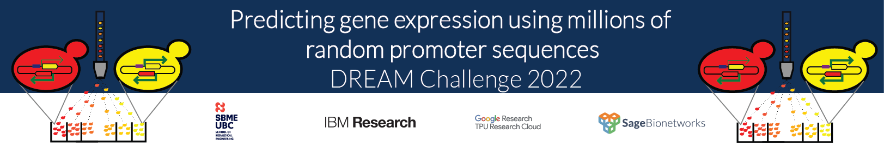

# DREAM Challenge 2022

## Predicting gene expression using millions of random promoter sequences by mt

### Abstract

### 1. Description of data usage

### 2. Description of the model

### 3. Training procedure

### 5. Contributions and Acknowledgement
#### 5.1 Contributions

#### 5.2 Acknowledgement

### 6. References

Click <a href="https://drive.google.com/drive/folders/1aziagRaXilzBIo1VwjQDkXi9kDMovmDn?usp=sharing">Here</a> to download the input files

